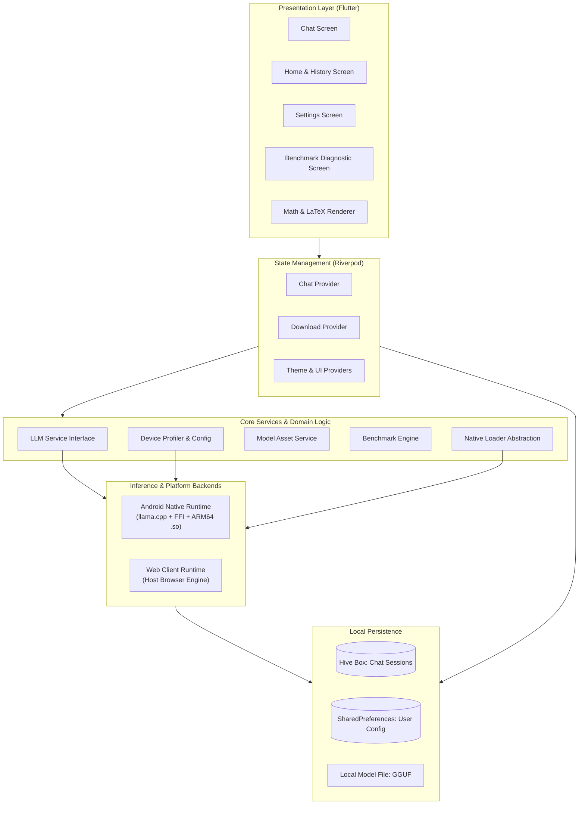

# Echo

Echo is a mobile-first, privacy-focused educational assistant powered by local on-device small language models (SLMs). It provides students with an intelligent, interactive tutor that operates completely offline on consumer smartphones without cloud dependencies.

---

## Problem Statement

Modern educational AI tools rely heavily on cloud-hosted language models, creating significant barriers for students worldwide:

- **Connectivity Divide**: Millions of learners in rural or low-bandwidth environments lack the stable, high-speed internet needed to query cloud APIs.
- **Latency and Cost**: Cloud API calls introduce network latency and recurrent bandwidth consumption that can be prohibitive on limited data plans.
- **Data Privacy**: Sensitive student inquiries, learning difficulties, and academic session histories are continuously transmitted to and stored on third-party servers.

Without an internet connection, existing digital tutoring assistants become completely unusable.

---

## Solution

Echo resolves this gap by embedding quantized language models directly onto the user's mobile device:

- **100% On-Device Inference**: After the initial model file is placed on the device, all prompt tokenization, inference computation, and response generation occur locally. No prompts, notes, or chat logs ever leave the phone.
- **Dynamic Hardware Profiling**: The system profiles available device memory (MemAvailable via system accounting) and battery level to automatically configure optimal context window sizes, thread allocation, and batch processing limits.
- **Real-Time Token Streaming**: Leverages background Dart isolates and FFI bindings to stream tokens asynchronously to the UI, keeping the interface responsive and interactive during generation.
- **STEM & Math Ready**: Full offline support for LaTeX math expressions (using KaTeX) and structured Markdown formatting for equations, code blocks, and diagrams.
- **Zero-Latency Local Storage**: Chat sessions, settings, and user progress are indexed and stored on-device using Hive and SharedPreferences.

---

## Team Details

### Team Name: Technauts

```text
       \ O /                 \ O /                 \ O /                  \ O /
         |                     |                     |                      |
        / \                   / \                   / \                    / \
   [Gowreesh VT]        [Yashwant Gokul]        [Prodhosh VS]       [Sri Saidhakshini]
```

- Gowreesh VT
- Yashwant Gokul
- Prodhosh VS
- Sri Saidhakshini

---

## Architecture

The application is structured into clearly separated layers: presentation, state coordination, domain services, platform abstractions, and local persistence.



---

## Tech Stack

### Core Technologies
- **Framework**: Flutter 3.22+
- **Language**: Dart 3.4+

### State Management
- **Riverpod**: Reactive dependency injection and unidirectional state management (`flutter_riverpod`, `riverpod_annotation`).

### Inference & Native Bindings
- **llama.cpp**: C++ inference engine for quantized GGUF models.
- **Dart FFI**: Low-overhead foreign function interface bridging Dart background isolates to precompiled ARM64 native binaries (`libllama.so`, `libggml.so`, `libomp.so`).

### Formatting & Rendering
- **flutter_math_fork**: Fast, offline KaTeX mathematical typesetting engine for inline and block equations.
- **flutter_markdown**: CommonMark rendering for formatted notes, tables, and highlighted code snippets.
- **Google Fonts**: Inter and Outfit typographic pairings.

### Persistence & Storage
- **Hive**: Lightweight, fast NoSQL key-value database written in pure Dart for storing conversation history and messages.
- **SharedPreferences**: Local key-value store for user preferences, dark/light themes, and profile flags.

### Hardware Profiling & Utilities
- **device_info_plus**: Runtime hardware identification and chipset profiling.
- **battery_plus**: Battery level and charging status monitoring for thermal throttling protection.
- **wakelock_plus**: Keeps the display active during long diagnostic benchmark runs.
- **dio**: Resumable HTTP downloads for initial model file acquisition.

---

## Getting Started

### Prerequisites

- **Flutter SDK**: Version 3.22 or higher ([flutter.dev](https://flutter.dev/docs/get-started/install))
- **Dart SDK**: Version 3.4 or higher (bundled with Flutter)
- **Target Platform**:
  - **Android**: Physical ARM64 device (recommended for native SLM inference with llama.cpp) or Android Emulator running API Level 24+
  - **Web**: Google Chrome or any modern Chromium/WebKit browser

---

### Installation & Setup

1. Clone the repository:
   ```bash
   git clone https://github.com/srisaidhakshini/resonance.git
   cd resonance
   ```

2. Fetch Flutter package dependencies:
   ```bash
   flutter pub get
   ```

3. Verify codebase integrity and ensure zero analysis errors:
   ```bash
   flutter analyze
   ```

---

### How to Run

#### Option 1: Web Browser (Instant Preview & Smart Pedagogical Engine)

You can run the web client using Flutter's development server or compile a production bundle:

1. **Development Server**:
   ```bash
   flutter run -d chrome
   ```

2. **Production Web Build & Local Server**:
   ```bash
   # Build the static web assets
   flutter build web --base-href "/"

   # Serve the build directory on port 8085 (using Python)
   python -m http.server 8085 --directory build/web
   ```
   Open your browser and navigate to:
   ```text
   http://localhost:8085/
   ```

*Note for Web*: Flutter Web sandboxes native C++ binaries (`libllama.so`). The web runtime automatically utilizes the built-in educational intelligence engine with LaTeX math typesetting, step-by-step arithmetic solvers, and local Ollama proxy capabilities if an Ollama instance is running locally on port 11434.

---

#### Option 2: Mobile (Android Physical Device with On-Device SLM)

1. Enable **Developer Options** and **USB Debugging** on your Android smartphone.
2. Connect your smartphone via USB and verify device detection:
   ```bash
   flutter devices
   ```
3. Run the app directly on your phone:
   ```bash
   flutter run --release
   ```
   *(Release mode is recommended for optimal inference speed and memory performance).*

4. **Model Initialization on Android**:
   - On first launch, the app prompts you to download the quantized small language model (`Qwen2.5-1.5B-Instruct-Q4_K_M.gguf`, ~1.1GB) and a small embedding model (~25MB) used for local retrieval.
   - Alternatively, you can copy the `.gguf` model file directly to the device storage directory via ADB:
     ```bash
     adb push qwen.gguf /sdcard/Android/data/com.example.echo/files/model/qwen.gguf
     ```
   - Once loaded, all inference computation, token generation, and chat persistence run completely offline.

---

### Troubleshooting

- **Android 64-bit Architecture**: Ensure your target device is an `arm64-v8a` device. The native C++ inference libraries are compiled for ARM64 architectures.
- **Port Conflicts on Web**: If port 8085 is in use, supply any available port (e.g., `python -m http.server 8080 --directory build/web`).
- **Memory Profiling**: On Android, Echo automatically inspects available system memory. If other heavy applications are running in background, close them to allow optimal context buffer allocation.