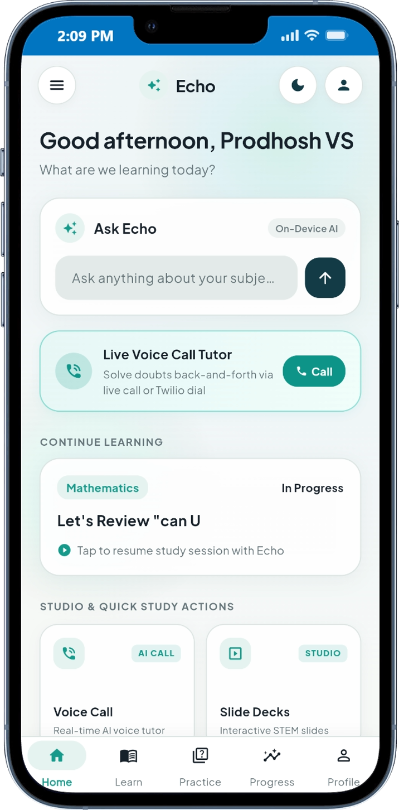
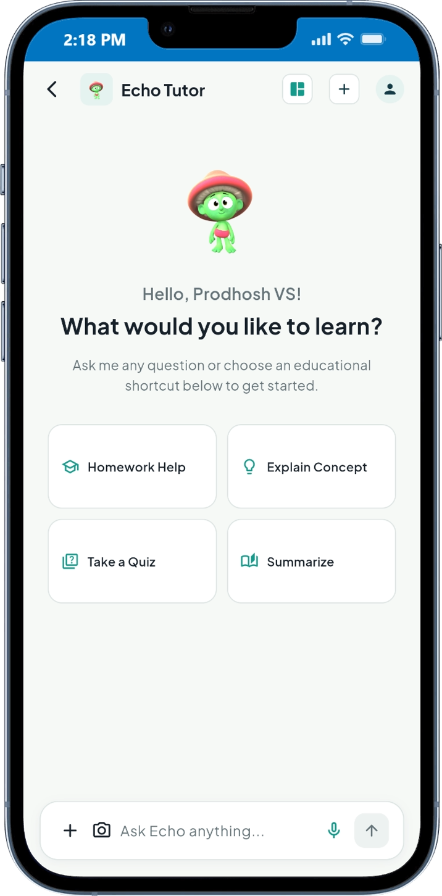
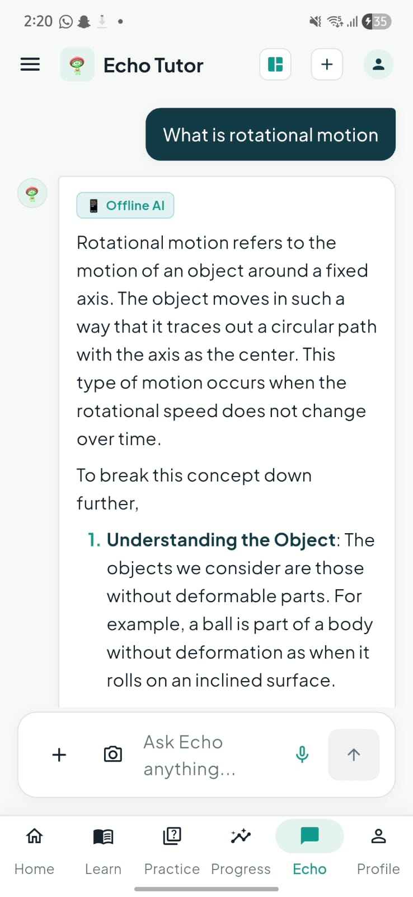
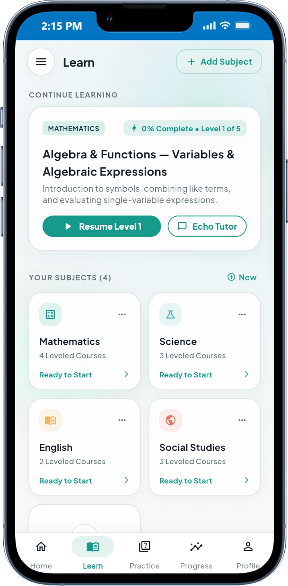
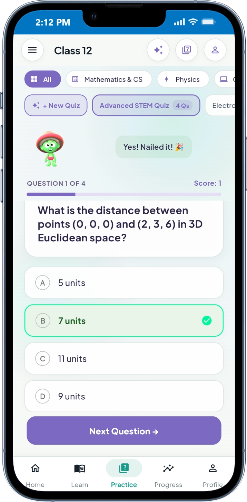
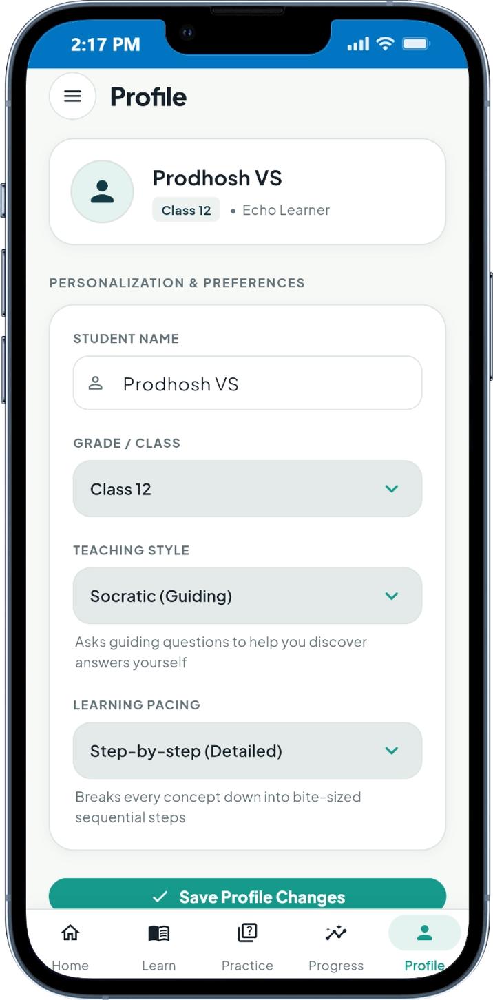
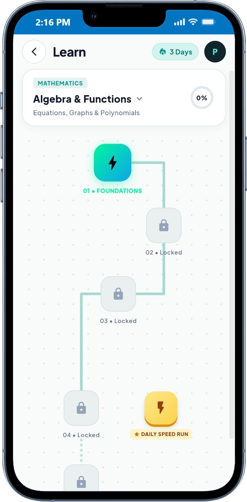
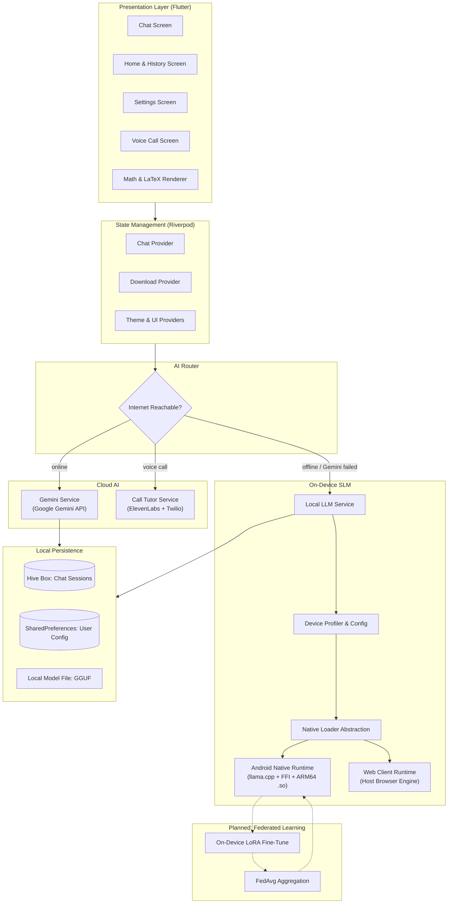

# Echo

Echo is a mobile-first educational assistant that puts a real tutor in a student's pocket — one that still works when the signal doesn't. The moment you have a connection, Echo hands your question to Gemini for a fast, high-quality answer. The moment you don't, it quietly falls back to a small language model running entirely on your own phone, no cloud round-trip required. You're never stuck waiting on a spinner because a bus went through a dead zone.

---

## Problem Statement

Modern educational AI tools rely heavily on cloud-hosted language models, creating significant barriers for students worldwide:

- **Connectivity Divide**: Millions of learners in rural or low-bandwidth environments lack the stable, high-speed internet needed to query cloud APIs.
- **Latency and Cost**: Cloud API calls introduce network latency and recurrent bandwidth consumption that can be prohibitive on limited data plans.
- **Data Privacy**: Sensitive student inquiries, learning difficulties, and academic session histories are continuously transmitted to and stored on third-party servers.

Without an internet connection, existing digital tutoring assistants become completely unusable — and pure on-device models alone still lag behind frontier cloud models on nuanced, multi-step reasoning.

---

## Solution

Echo doesn't force a choice between "always great, but online-only" and "always available, but weaker." It gives you both, and switches between them for you:

- **Hybrid AI Routing**: An `AIRouter` checks live internet reachability before every message. Online, it streams the response straight from **Google Gemini** for the strongest possible answer. If Gemini errors out mid-stream, or there's no connection at all, it transparently drops down to the **on-device SLM** — same chat, same UI, the student never has to think about which "mode" they're in.
- **100% On-Device Fallback**: When offline, all prompt tokenization, inference, and response generation happen locally via `llama.cpp` + Dart FFI. No prompts, notes, or chat logs leave the phone in this mode.
- **Voice Tutoring, Phone-Call Style**: Echo can place a real outbound phone call to a student (via Twilio) and hand the conversation to an **ElevenLabs** Conversational AI agent, so a student without a smartphone in hand — or one who just learns better by talking — can get tutored over an ordinary voice call.
- **Dynamic Hardware Profiling**: The system profiles available device memory and battery level to automatically configure optimal context window sizes, thread allocation, and batch processing limits for the local model.
- **Real-Time Token Streaming**: Background Dart isolates and FFI bindings stream tokens asynchronously to the UI, whether the answer is coming from Gemini or the local model, so the interface stays responsive either way.
- **STEM & Math Ready**: Full support for LaTeX math expressions (KaTeX) and structured Markdown for equations, code blocks, and diagrams, in both online and offline modes.
- **Zero-Latency Local Storage**: Chat sessions, settings, and user progress are indexed and stored on-device using Hive and SharedPreferences, regardless of which AI provider answered.
- **Built for Federated Learning**: The on-device model was deliberately picked (Qwen2.5-1.5B, not the smaller 0.5B) to stay compatible with a planned federated LoRA fine-tuning pipeline — students' devices will eventually be able to train small local adapters on their own study patterns and contribute anonymized weight updates back via FedAvg, so the tutor keeps improving without anyone's raw chat data ever leaving their phone.

---

## Team Details

### Team Name: Technauts

```text
       \ O /                 \ O /                 \ O /                  \ O /
         |                     |                     |                      |
        / \                   / \                   / \                    / \
   [Gowreesh VT]        [Yashwant Gokul]        [Prodhosh VS]       [Sri Saidhakshini]
```

- Gowreesh VT
- Yashwant Gokul
- Prodhosh VS
- Sri Saidhakshini

---

## Screenshots

<table>
  <tr>
    <td align="center"><br/><sub>Home</sub></td>
    <td align="center"><br/><sub>Chat Interface</sub></td>
    <td align="center"><br/><sub>Chatbot Response</sub></td>
  </tr>
  <tr>
    <td align="center"><br/><sub>Learn</sub></td>
    <td align="center"><br/><sub>Quiz</sub></td>
    <td align="center"><br/><sub>Profile</sub></td>
  </tr>
  <tr>
    <td align="center"><br/><sub>Roadmap</sub></td>
  </tr>
</table>

---

## Architecture

The application is structured into clearly separated layers: presentation, state coordination, domain services, platform abstractions, and local persistence.



---

## Tech Stack

### Core Technologies
- **Framework**: Flutter 3.22+
- **Language**: Dart 3.4+

### State Management
- **Riverpod**: Reactive dependency injection and unidirectional state management (`flutter_riverpod`, `riverpod_annotation`).

### Cloud AI
- **Google Gemini API**: Primary answer source whenever the device has internet — chosen for `AIRouter` first, with the on-device model as automatic fallback on failure or offline.
- **ElevenLabs Conversational AI**: Powers Echo's voice-call tutoring mode with natural, low-latency speech.
- **Twilio**: Places the actual outbound phone call that connects a student to the ElevenLabs voice agent.

### Inference & Native Bindings
- **llama.cpp**: C++ inference engine for quantized GGUF models, used for the fully offline fallback path.
- **Dart FFI**: Low-overhead foreign function interface bridging Dart background isolates to precompiled ARM64 native binaries (`libllama.so`, `libggml.so`, `libomp.so`).

### Planned: Federated Learning
- The on-device model (Qwen2.5-1.5B-Instruct) was picked specifically to stay training-friendly for a future federated LoRA pipeline: devices fine-tune small local adapters on their own usage, contribute anonymized weight updates via FedAvg, and the merged model gets redistributed — no raw student data ever leaves the device.

### Formatting & Rendering
- **flutter_math_fork**: Fast, offline KaTeX mathematical typesetting engine for inline and block equations.
- **flutter_markdown**: CommonMark rendering for formatted notes, tables, and highlighted code snippets.
- **Google Fonts**: Inter and Outfit typographic pairings.

### Persistence & Storage
- **Hive**: Lightweight, fast NoSQL key-value database written in pure Dart for storing conversation history and messages.
- **SharedPreferences**: Local key-value store for user preferences, dark/light themes, and profile flags.

### Hardware Profiling & Utilities
- **device_info_plus**: Runtime hardware identification and chipset profiling.
- **battery_plus**: Battery level and charging status monitoring for thermal throttling protection.
- **wakelock_plus**: Keeps the display active during long diagnostic benchmark runs.
- **dio**: Resumable HTTP downloads for initial model file acquisition.

---

## Getting Started

### Prerequisites

- **Flutter SDK**: Version 3.22 or higher ([flutter.dev](https://flutter.dev/docs/get-started/install))
- **Dart SDK**: Version 3.4 or higher (bundled with Flutter)
- **Target Platform**:
  - **Android**: Physical ARM64 device (recommended for native SLM inference with llama.cpp) or Android Emulator running API Level 24+
  - **Web**: Google Chrome or any modern Chromium/WebKit browser

---

### Installation & Setup

1. Clone the repository:
   ```bash
   git clone https://github.com/srisaidhakshini/resonance.git
   cd resonance
   ```

2. Fetch Flutter package dependencies:
   ```bash
   flutter pub get
   ```

3. Verify codebase integrity and ensure zero analysis errors:
   ```bash
   flutter analyze
   ```

---

### How to Run

#### Option 1: Web Browser (Instant Preview & Smart Pedagogical Engine)

You can run the web client using Flutter's development server or compile a production bundle:

1. **Development Server**:
   ```bash
   flutter run -d chrome
   ```

2. **Production Web Build & Local Server**:
   ```bash
   # Build the static web assets
   flutter build web --base-href "/"

   # Serve the build directory on port 8085 (using Python)
   python -m http.server 8085 --directory build/web
   ```
   Open your browser and navigate to:
   ```text
   http://localhost:8085/
   ```

*Note for Web*: Flutter Web sandboxes native C++ binaries (`libllama.so`). The web runtime automatically utilizes the built-in educational intelligence engine with LaTeX math typesetting, step-by-step arithmetic solvers, and local Ollama proxy capabilities if an Ollama instance is running locally on port 11434.

---

#### Option 2: Mobile (Android Physical Device with On-Device SLM)

1. Enable **Developer Options** and **USB Debugging** on your Android smartphone.
2. Connect your smartphone via USB and verify device detection:
   ```bash
   flutter devices
   ```
3. Run the app directly on your phone:
   ```bash
   flutter run --release
   ```
   *(Release mode is recommended for optimal inference speed and memory performance).*

4. **Model Initialization on Android**:
   - On first launch, the app prompts you to download the quantized small language model (`Qwen2.5-1.5B-Instruct-Q4_K_M.gguf`, ~1.1GB) and a small embedding model (~25MB) used for local retrieval.
   - Alternatively, you can copy the `.gguf` model file directly to the device storage directory via ADB:
     ```bash
     adb push qwen.gguf /sdcard/Android/data/com.example.echo/files/model/qwen.gguf
     ```
   - Once loaded, all inference computation, token generation, and chat persistence run completely offline.

---

### Troubleshooting

- **Android 64-bit Architecture**: Ensure your target device is an `arm64-v8a` device. The native C++ inference libraries are compiled for ARM64 architectures.
- **Port Conflicts on Web**: If port 8085 is in use, supply any available port (e.g., `python -m http.server 8080 --directory build/web`).
- **Memory Profiling**: On Android, Echo automatically inspects available system memory. If other heavy applications are running in background, close them to allow optimal context buffer allocation.