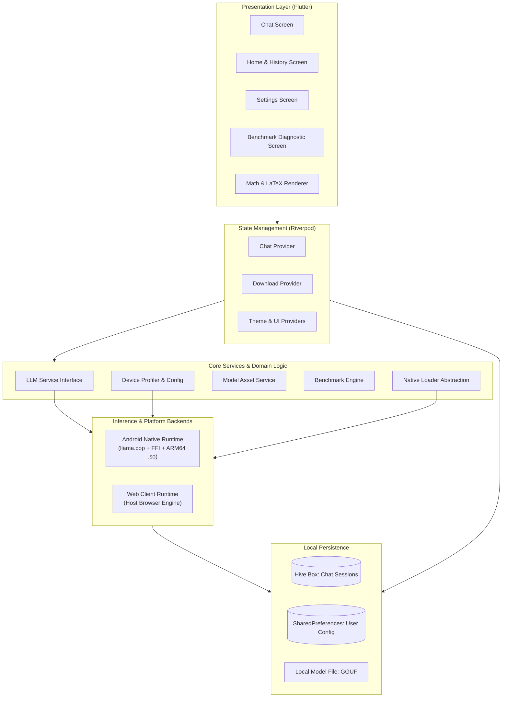

# Resonance

Resonance is a mobile-first, privacy-focused educational assistant powered by local on-device small language models (SLMs). It provides students with an intelligent, interactive tutor that operates completely offline on consumer smartphones without cloud dependencies.

---

## Problem Statement

Modern educational AI tools rely heavily on cloud-hosted language models, creating significant barriers for students worldwide:

- **Connectivity Divide**: Millions of learners in rural or low-bandwidth environments lack the stable, high-speed internet needed to query cloud APIs.
- **Latency and Cost**: Cloud API calls introduce network latency and recurrent bandwidth consumption that can be prohibitive on limited data plans.
- **Data Privacy**: Sensitive student inquiries, learning difficulties, and academic session histories are continuously transmitted to and stored on third-party servers.

Without an internet connection, existing digital tutoring assistants become completely unusable.

---

## Solution

Resonance resolves this gap by embedding quantized language models directly onto the user's mobile device:

- **100% On-Device Inference**: After the initial model file is placed on the device, all prompt tokenization, inference computation, and response generation occur locally. No prompts, notes, or chat logs ever leave the phone.
- **Dynamic Hardware Profiling**: The system profiles available device memory (MemAvailable via system accounting) and battery level to automatically configure optimal context window sizes, thread allocation, and batch processing limits.
- **Real-Time Token Streaming**: Leverages background Dart isolates and FFI bindings to stream tokens asynchronously to the UI, keeping the interface responsive and interactive during generation.
- **STEM & Math Ready**: Full offline support for LaTeX math expressions (using KaTeX) and structured Markdown formatting for equations, code blocks, and diagrams.
- **Zero-Latency Local Storage**: Chat sessions, settings, and user progress are indexed and stored on-device using Hive and SharedPreferences.

---

## Team Details

### Team Name: Technauts

```text
       \ O /                 \ O /                 \ O /                  \ O /
         |                     |                     |                      |
        / \                   / \                   / \                    / \
   [Gowreesh VT]        [Yashwant Gokul]        [Prodhosh VS]       [Sri Saidhakshini]
```

- Gowreesh VT
- Yashwant Gokul
- Prodhosh VS
- Sri Saidhakshini

---

## Architecture

The application is structured into clearly separated layers: presentation, state coordination, domain services, platform abstractions, and local persistence.



---

## Tech Stack

### Core Technologies
- **Framework**: Flutter 3.22+
- **Language**: Dart 3.4+

### State Management
- **Riverpod**: Reactive dependency injection and unidirectional state management (`flutter_riverpod`, `riverpod_annotation`).

### Inference & Native Bindings
- **llama.cpp**: C++ inference engine for quantized GGUF models.
- **Dart FFI**: Low-overhead foreign function interface bridging Dart background isolates to precompiled ARM64 native binaries (`libllama.so`, `libggml.so`, `libomp.so`).

### Formatting & Rendering
- **flutter_math_fork**: Fast, offline KaTeX mathematical typesetting engine for inline and block equations.
- **flutter_markdown**: CommonMark rendering for formatted notes, tables, and highlighted code snippets.
- **Google Fonts**: Inter and Outfit typographic pairings.

### Persistence & Storage
- **Hive**: Lightweight, fast NoSQL key-value database written in pure Dart for storing conversation history and messages.
- **SharedPreferences**: Local key-value store for user preferences, dark/light themes, and profile flags.

### Hardware Profiling & Utilities
- **device_info_plus**: Runtime hardware identification and chipset profiling.
- **battery_plus**: Battery level and charging status monitoring for thermal throttling protection.
- **wakelock_plus**: Keeps the display active during long diagnostic benchmark runs.
- **dio**: Resumable HTTP downloads for initial model file acquisition.

---

## Getting Started

### Prerequisites

- Flutter SDK (version 3.22 or higher)
- Android SDK (API Level 24 or higher recommended)
- Physical Android phone with ARM64 CPU (recommended for on-device inference) or a modern web browser for preview

### Installation

1. Clone the repository:
   ```bash
   git clone https://github.com/srisaidhakshini/resonance.git
   cd resonance
   ```

2. Install dependencies:
   ```bash
   flutter pub get
   ```

3. Verify codebase integrity:
   ```bash
   flutter analyze
   ```

### Running the App

#### Mobile (Android)
Ensure your Android device has Developer Options and USB Debugging enabled:
```bash
flutter run
```

#### Web Browser
Run the local web preview:
```bash
flutter run -d chrome
```
Or build the static web bundle:
```bash
flutter build web
```